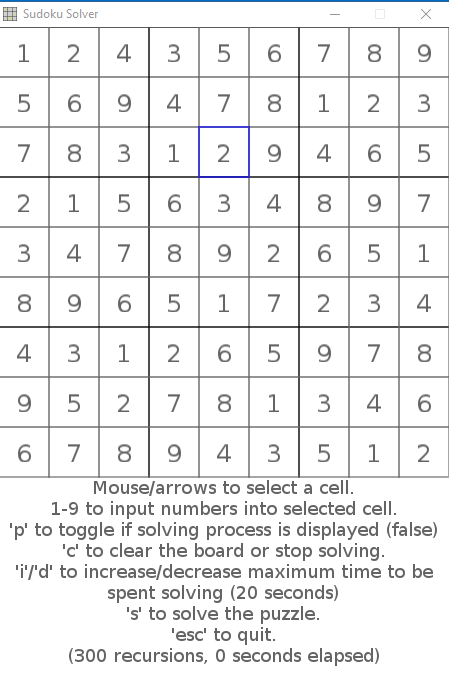

# Sudoku Solver

A Sudoku Solver made with [Lua](https://www.lua.org/) and [Love2D](https://love2d.org/).

## Getting Started

Prebuilt binaries are available for Windows 32-bit and 64-bit [here](https://github.com/davidtranhq/sudoku-solver/releases)

Alternatively, you can build the project yourself:

### Prerequisites
* [Love2D 0.10.1](https://github.com/love2d/love/releases/tag/0.10.1)

Note: Downloading Lua is not necessary because it comes packaged with Love2D.

### Build

1. Download and extract the love-0.10.1-win(64 or 32).zip file linked above.

2. Clone the repository with `git clone https://github.com/davidtranhq/sudoku-solver`

3. Folllow the directions specific to your platform outlined [here](https://love2d.org/wiki/Game_Distribution)
